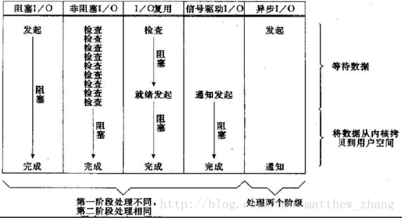

### Netty面试题

#### 1. BIO/NIO/AIO的区别

+ 什么是BIO

```
Blocking I/O 是一种阻塞 + 同步的通信模式。
```

+ 什么是NIO

```
New IO 或者 Non Blocking IO 
Java NIO三大组件:
Channel：
Buffer:
Selector：
```

+ 什么是AIO

```
异步io
```

+ Unix的IO模型 **https://blog.csdn.net/matthew_zhang/article/details/71328697**

```
1. 异步io: 用户发起请求后，不必等待数据，操作系统负责io操作，将io数据->内核->用户空间的缓冲区之后通知应用程序。整个数据拷贝过程是完全由os来执行，用户程序不参与任何操作，等待os发起通知。
2. 同步io: 用户发起io请求后，要将数据从内核空间拷贝到用户程序的缓冲区。
3. 阻塞/非阻塞: 用户发起io请求后，会立即返回信息标志，表示请求条件是否满足。是非阻塞的。
```

```
Unix的五种io模型
Blocking I/O
No-Blocking I/O
I/O Multiplexing
Sigle-Driven I/O
Asynchronous I/O  --> 异步io
```



```
Netty中，在5.0版本引入了AIO，但是因为重大Bug撤回了该版本，目前广泛使用的4.0版本仍然使用的同步非阻塞IO。
```

#### 什么是Netty

```

```

