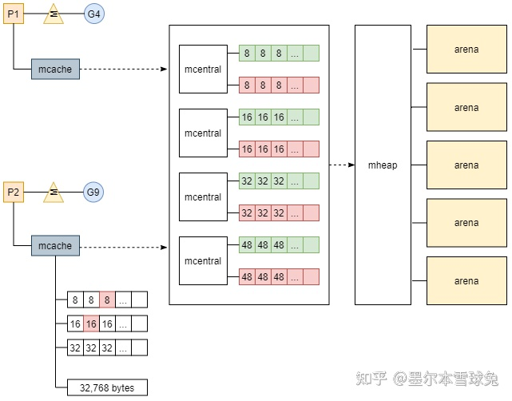

##  Golang面试整理

#### 一. slice底层原理与数组的区别

```
1.数组是固定长度的相同类型的元素序列。
2.数组在传递的时候是值传递，将数值复制给一个新的变量或者方法参数传递的时候，都会进行拷贝。

slice本身的长度是不固定的，相当于动态数组。
slice持有了一个源数组在内存地址中的引用，多个slice可以共享一个原数组。
```

```go
type slice struct {
 array unsafe.Pointer // 指向源数组中第一个可以访问的位置
 len int // slice的长度
 cap int // array.len -> pointer的长度
}
```

+ slice的创建

```go
slice := make([]int,10) // cap = 10 len = 10
1. 底层创建了len = 10的array
2. Pointer指向了idx = 0
3. slice.len = 10 slice.cap = 10
slice := make([]int,10,20) // cap = 20 len = 10
1. 底层创建了len = 20的array
2. Pointer指向了idx = 0
3. slice.len = 10 slice.cpa = 20
```

+ slice的扩容机制

```go
扩容是为切片分配新的内存空间并拷贝原切片中元素的过程
如果期望容量大于当前容量的两倍就会使用期望容量；
如果当前切片的长度小于 1024 就会将容量翻倍；
如果当前切片的长度大于 1024 就会每次增加 25% 的容量，直到新容量大于期望容量；
```

#### 二. defer的执行顺序

```
defer语句后的语句将会被延迟执行。defer归属的函数即将返回时，defer按照逆序执行。
defer可以用来在函数退出的时候，释放资源。
+ 多个defer语句的执行顺序
多个defer行为被注册的时候，以逆序的形式后进先出。

函数的参数会被预先计算；
调用 runtime.deferproc 函数创建新的延迟调用时就会立刻拷贝函数的参数，函数的参数不会等到真正执行时计算；
```

+ defer和return的执行顺序

```go
func test() int {//这里返回值没有命名
    var i int
    defer func() {
        i++
        fmt.Println("defer1", i) //作为闭包引用的话，则会在defer函数执行时根据整个上下文确定当前的值。i=2
    }()
    defer func() {
        i++
        fmt.Println("defer2", i) //作为闭包引用的话，则会在defer函数执行时根据整个上下文确定当前的值。i=1
    }()
    return i
}

func test() (i int) { //返回值命名i
    defer func() {
        i++
        fmt.Println("defer1", i)
    }()
    defer func() {
        i++
        fmt.Println("defer2", i)
    }()
    return i
}
/*
defer2 1
defer1 2
return: 0

defer2 1
defer1 2
return: 2
*/
```

```
return不是原子操作，return分为两步；第一步赋值，如果有命名的返回值直接返回，如果没有命名会指定一个默认的返回值执行赋值。第二步函数执行返回机制。
defer和return的执行顺序是:
1. return 进行复制
2. defer 逆序执行
3. return执行返回
```

#### 三. Channel总结(有缓存的管道和没有缓存的管道区别是什么)

```
Go语言中最常见的设计模式是:不要通过共享内存来通讯而是通过通讯的方式共享内存。
在其他语言中,许多线程传递数据的方式是通过共享内内存,同时要控制这块线程的访问。
Go提供了一种不同的并发模式CSP(Communicating sequential processs).通讯顺序进程。
```

+ 数据结构

```go
type hchan struct {
	qcount   uint
	dataqsiz uint
	buf      unsafe.Pointer
	elemsize uint16
	closed   uint32
	elemtype *_type
	sendx    uint
	recvx    uint
	recvq    waitq
	sendq    waitq

	lock mutex
}
/* 
qcount、dataqsiz、buf、sendx、recv 构建了缓冲的循环队列
recvq、sendq、mutex用来控制数据的同步
```

+ 发送数据 chan <- i

```go
在真正发送数据的逻辑执行之前,会为chan加锁,防止多个goroutine并发的修改chan.并检查chan是否关闭。
func chansend(c *hchan, ep unsafe.Pointer, block bool, callerpc uintptr) bool {
	lock(&c.lock)

	if c.closed != 0 {
		unlock(&c.lock)
		panic(plainError("send on closed channel"))
	}
所有发送数据操作会被编译成执行chansend()方法。该方法会做如下进行:
1. 如果chan的recvq中存在阻塞接受的Goroutine,直接将数据发送给接受者 runtime.send(),并将该goroutine设置为下一个运行的Goroutine。
2. 如果缓冲区存在空间,将数据写入chan的缓冲区(底层的循环队列)的sedx位置上
3. 如果不存在或者缓冲区已满,创建一个runtime.sudog结构并将其加入到chan的sendq队列中,当前goroutine也会阻塞等待。
```

+ 接受数据 i <- chan

```go
i <- chan ==> chanrecv1()
i,ok <- chan ==> chanrecv2()
以上两种方式最后都会被编译器转换为 chanrecv()函数执行,接收数据会如下进行:
1. 如果chan中的sendq存在阻塞的发送者,直接从发送者接受数据
2. 如果缓冲区存在数据,从缓冲去接受数据。
3. 如果缓冲区中不存在数据,进入reccq队列中阻塞。
```

```
Channel是goRoutine之间的通信桥梁。go语言通过通信来共享内存数据。
channel是goroutine安全的
channel提供了FIFO语义
channel可以使goroutine block/unblock
```

```go
ch1 := make(chan int)
ch2 := make(chan int,1)
1. 无缓冲的管道必须要求goroutine之间同时完成接受和发送动作，如果无人接受，发送方将阻塞。
2. 有缓冲的管道不要求接受和发送同时完成，在缓冲没有满的情况下，向管道发送数据是不阻塞的。只有向缓冲满了的管道发送数据以及向空的管道接受数据的goroutine才会阻塞。
```

+ select操作

```go
select和swich控制结构类似,但是case只能是针对chan的收发操作。
func fibonacci(c, quit chan int) {
	x, y := 0, 1
	for {
		select {
		case c <- x:
			x, y = y, x+y
		case <-quit:
			fmt.Println("quit")
			return
		}
	}
}
```

#### 四. map的实现 [清晰的参考文章](https://studygolang.com/articles/32943)

```
hashTable实现，通过链地址法处理冲突。Array + Array的链表。
```

golang中的map依然采用的hash表的方式进行映射,但是处理hash冲突的方式不同于传统链表实现,而是使用一个长度为8的连续数组bmap.

+ hmap

```go
type hmap struct {
	count     int	
	flags     uint8
	B         uint8
	noverflow uint16
	hash0     uint32

	buckets    unsafe.Pointer
	oldbuckets unsafe.Pointer
	nevacuate  uintptr

	extra *mapextra
}
/*hmap结构
count: 描述当前元素个数
hash0: hash因子，用来随机生成hashcode
B: bmap个数的位数
buckets: 指向bmap[]
```

+ bmap

```go
type bmap struct {
    topbits  [8]uint8
    keys     [8]keytype
    values   [8]valuetype
    pad      uintptr
    overflow uintptr
}
/*bmap 桶结构
topbits[]: 记录key-hash的高八位,用来快速比较key
keys/values: 长度8的key/val对应的数组
overflow: 指向溢出处理的桶
```

+ 读map[key]: map[key]方法会在编译器生成中间代码 mapaccess()方法执行。

```go
func mapaccess1(t *maptype, h *hmap, key unsafe.Pointer) unsafe.Pointer {
	alg := t.key.alg
	hash := alg.hash(key, uintptr(h.hash0))  // 1. 获取hashCode
	m := bucketMask(h.B)	// 2. 求出当前的掩码
	b := (*bmap)(add(h.buckets, (hash&m)*uintptr(t.bucketsize))) // 3. 计算在buckets上的映射,获得对应bmap的指针
	top := tophash(hash) // 求高8位值进行快速比较
    
    // 进行遍历
bucketloop:
	for ; b != nil; b = b.overflow(t) { // for 遍历当前桶和溢出桶 b b.overflow
		for i := uintptr(0); i < bucketCnt; i++ {
			if b.tophash[i] != top {	// 如果高8位不同,跳过,如果是nil,跳出大循环
				if b.tophash[i] == emptyRest {
					break bucketloop
				}
				continue
			}
			k := add(unsafe.Pointer(b), dataOffset+i*uintptr(t.keysize))// 高8位相同,计算出keys上的地址
			if alg.equal(key, k) { // 如果key相同,计算对应的vals地址并返回
				v := add(unsafe.Pointer(b), dataOffset+bucketCnt*uintptr(t.keysize)+i*uintptr(t.valuesize))
				return v
			}
		}
	}
	return unsafe.Pointer(&zeroVal[0])
}
```

+ 写map[key] = val: 中间代码执行mapassign()方法。

```go
func mapassign(t *maptype, h *hmap, key unsafe.Pointer) unsafe.Pointer 
/* 
1. 首先通过key获取对应的hashcode和bmap
2. 遍历bmap上的topHash和key,如果找到相同的key,返回对应的地址
3. 如果key不在bmap中,map会为新的key/val规划内存地址
4. 如果key不在,同时bmap满了,map会调用newoverflow创建溢出桶或者在已经创建好的桶中进行追加。
```

+ 扩容机制,随着元素的增加,碰撞会逐渐增加,性能会恶化。

```go
// mapassign函数在以下两种情况出发扩容:
// 1. 装载因子 > 6.5
// 2. 溢出桶过多
//在扩容期间访问哈希表时会使用旧桶，向哈希表写入数据时会触发旧桶元素的分流。除了这种正常的扩容之外，为了解决大量写入、删除造成的内存泄漏问题，哈希引入了 sameSizeGrow 这一机制，在出现较多溢出桶时会整理哈希的内存减少空间的占用。
```

+ Maps 是线程安全的吗？怎么解决它的并发安全问题？

```
原生的map肯定不是并发安全的，想要解决并发安全那就加锁sync.Map
```

```go
var counter = struct{
    sync.RWMutex
    m map[string]int
}{m: make(map[string]int)}
```

#### 五. 进程、线程、协程的区别和联系 [Golang协程详解和应用](https://zhuanlan.zhihu.com/p/74047342)关于进程线程和Go协程总结

#### [关于进程线程和Go协程总结](https://blog.csdn.net/weixin_40051278/article/details/99286534)

+ 进程

```
进程就是程序的动态运行过程，进程是操作系统资源分配的基本单位。
进程在运行过程中，需要分配内存以及CPU的时间片。在线程之前，进程也是CPU调度的基本单位。
但是: 进程在调度上的成本非常高，上下文切换开销大。于是，考虑将CPU调度和资源分配隔离开来。
```

+ 线程

```
线程是比进程更轻量的调度执行单位，也是如今CPU调度的基本单位。
线程的引入将CPU调度和资源分配隔离开来，各个线程既可以共享进程资源，又可以独立的调度。
线程只需要分配少量资源，比如程序计数器、寄存器和栈。切换开销很小。
从一个应用程序的角度，线程的创建是在进程内部的，而进程内部的线程需要操作系统线程的支持。常见的有1:N和1:1模型。1:1模型的实现，每一个进程内部的线程都需要操作系统的内核线程来支持。所以，线程的创建、调度、阻塞都交给操作系统来实现，这样的好处是显然是很方便的，但是线程的操作会造成频繁的方法调用和内核切换，同时1:1的模型并不能充分发挥CPU的能力。
```

+ 协程

```
协程可以叫做轻量级线程，又可以叫用户级线程。他是基于1:N线程模型来实现的。协程是应用系统自己来实现调度处理。如果调度机制实现得当，大部分操作是不需要进入内核态的。可以充分发挥支持线程的能力。
同时，线程的栈大小固定的而协程栈大小是可以动态调整的。
携程虽然有上述的优势，但是调度机制完全由应用系统自己实现，比较困难和复杂。
```

+ 简单介绍 GMP 模型以及该模型的优点 [GM到GMP，Golang经历了什么？ | Go 技术论坛 (learnku.com)](https://learnku.com/articles/57177)
+ GM模型与GMP模型


```go
GM模型: G统一放在一个加锁了的全局G队列中,M线程去队列中取出G进行执行,同时如果执行的G产生出了新的G,仍然放入全局队列中。
问题: 
1. 获取G都需要请求获取队列的锁,造成了严重的锁争用,性能下降严重。
2. 新产生的G会被放入全局队列中,造成相关的G1,G2不在同一个M中执行。

GMP模型: 在GM中增加了一层Processor.Processor自己本身维护一个队列,新产生的G优先放入自己的队列中，P的队列上限是256。
一. 如果G1在运行过程中产生了G2有限放入自己的队列，如果队列满了会将队列中一般的G放入全局队列
二. 如果P的本地队列为空,那们会从全局或者其他P中偷取一半的G
```


```go
G -> Goroutine: P调度器中待执行的任务,G相较于调度器类似线程对于操作系统,是用户级线程(协程).相比于线程具有更小的栈空间,上下文切换开销比较低。
type g struct {
    // 栈相关信息
	stack       stack
	stackguard0 uintptr
    // 抢占调度
    preempt       bool // 抢占信号
	preemptStop   bool // 抢占时将状态修改成 `_Gpreempted`
	preemptShrink bool // 在同步安全点收缩栈
    // 处理defer和panic链表
    _panic       *_panic // 最内侧的 panic 结构体
	_defer       *_defer // 最内侧的延迟函数结构体
    // 其他
    m              *m // 当前执行的线程
	sched          gobuf // 存储调度相关信息
	atomicstatus   uint32 // goroutine状态
	goid           int64
}
```

```go
M -> machine: M对应的是操作系统级别的线程.GOMAXPROCS对应了活跃线程数个数，默认情况下会设置为CPU核心数量。m:N模型，每个核心一个线程保证不会频繁出发线程调度和上下文切换。所有的调度都会发生在用户态
type m struct {
	g0   *g
	curg *g
    // 正在处理p 暂存nextp 之前处理oldp
    p             puintptr
	nextp         puintptr
	oldp          puintptr
}
```

```go
P -> process: 调度器,是M和G中间层,为M提供上下文环境,负责调度G,使得M能执行多个G。P和M是绑定的,P的数量也是GOMAXPROCS。
type p struct {
	m           muintptr 	// 

	runqhead uint32 // go
	runqtail uint32
	runq     [256]guintptr // goroutine队列
	runnext guintptr
	...
}
```

+ 简述 Golang 的伪抢占式调度/goroutine的调度流程

#### 六. Golang 垃圾回收机制

```
Golang GC采用的三色标记+读写混合屏障
```

#### 七. Golang中的指针使用

#### 八. go的内存分配

+ 分配方式

```
编程语言的内存分配方式有两种: 线性连续分配和空闲链表分配
线性连续分配: 
1. 是一种高效的分配方式,但是局限性大。只需要维护一个分配指针,分配时顺序移动指针。
2. 顺序分配速度快,复杂度低,但是无法重用已经分配过的内存容易产生内存碎片,所以要配合合适的gc算法。
离散空闲链表分配:
1. 维护一个类似链表的数据结构,管理的内存是离散的,分配内存时候通过遍历该链表找到合适的位置进行分配
2. 离散分配可以重新利用资源,但是遍历的时间复杂度是O(n)
离散分配内存选择策略:
1. 首次适应
2. 循环首次适应
3. 最优适应
4. 隔离适应: 将内存分割成不同种类链表,每个链表维护的块大小不相同,申请内存先搜索合适的链表的大小再遍历链表。
```

+ go语言中的分配方式


```go
type mspan struct {
    
    next *mspan // 双向链表
	prev *mspan
    
	startAddr uintptr // 起始地址
	npages    uintptr // 页数
	freeindex uintptr

	allocBits  *gcBits
	gcmarkBits *gcBits
	allocCache uint64
	...
}
mspan是一个双向的内存链表,npages标识该链表维护多大的内存块。例如mcache就维护了多个mspan链表:
```


#### 内存管理组件

go语言内存分配分为三个层级: mcache、mcentral、mheap。并根据对象的大小决定分配的方式。



+ 线程缓存 mcache

```go
线程缓存与线程处理器P一一对应，用来缓存用户申请的微小对象。
type mcache struct {
	// The following members are accessed on every malloc,
	// so they are grouped here for better caching.
	nextSample uintptr // trigger heap sample after allocating this many bytes
	scanAlloc  uintptr // bytes of scannable heap allocated

	// Allocator cache for tiny objects w/o pointers.
	tiny       uintptr
	tinyoffset uintptr
	tinyAllocs uintptr

	// The rest is not accessed on every malloc.
	alloc [numSpanClasses]*mspan // spans to allocate from, indexed by spanClass

	stackcache [_NumStackOrders]stackfreelist
}
通过持有[]*mspan数组,数组中的msapn是不同管理不同内存大小的mspan链表。

msapn的申请:
1. 在初始化mcache(runtime.allocmcache)时候,mspan是空的占位符。
2. 在对象分配时,如果是刚初始化或者mspan没有空间,就会从mcentral中申请新的msapn加入到链表中。
微分配器:
小于16字节的对象被认为是微对象,为了减少空间浪费，微对象不会单独在mspan分配,而是通过微分配器整合之后分配.
```

+ 中心缓存 mcentral

```go
线程缓存与P对应的,中心缓存的时全局P共享的,对于中心缓存的访问需要互斥锁。
type mcentral struct {
	spanclass spanClass
	partial  [2]spanSet
	full     [2]spanSet
}
每个中心缓存上维护了某个内存跨度的mspan集合。线程缓存会寻找合适的中心缓存申请空先的span然后加入到字节的mspan链表中。如果,中心缓存上没有了资源,就会透过mheap去申请资源。
```

+ 页对 mheap

```go
mheap时内存分配的核心结构体,mheap维护了两种重要的结构:
mcentral数组,长度时68*2,包含68中跨度。是全局的中心缓存列表。
另外一个是arnas,管理堆内存区域的相关字段。
type mheap struct {
	central [numSpanClasses]struct { // mcentral数组
		mcentral mcentral
	}

	spanalloc             fixalloc // allocator for span*
	cachealloc            fixalloc // allocator for mcache*
	specialfinalizeralloc fixalloc // allocator for specialfinalizer*
	specialprofilealloc   fixalloc // allocator for specialprofile*
	speciallock           mutex    // lock for special record allocators.
	arenaHintAlloc        fixalloc // allocator for arenaHints
}
heap通过arena管理一块足够大的连续内存,64M。arena通过bitmap对内存进行管理,并和mspan进行映射。
 type heapArena struct {
     bitmap [heapArenaBitmapBytes]byte
     spans [pagesPerArena]*mspan
     pageInUse [pagesPerArena / 8]uint8
     pageMarks [pagesPerArena / 8]uint8
     pageSpecials [pagesPerArena / 8]uint8
     checkmarks *checkmarksMap
     zeroedBase uintptr
 }
```

#### 对象的分配过程

+ 微对象(0,16B)

```go
使用微分配器提高内存分配的性能,将多个微对象合并分配在一个内存块中.
微分配器 -> 线程缓存 -> 中心缓存 -> 页堆
```

+ 小对象(16B,32KB)

```
确定分配对象的大小和所需要的span大小
按照 mcahce -> mcentral -> mheap 的优先顺序
```

+ 大对象(32KB,~)

```
直接在堆上进行分配。
```

